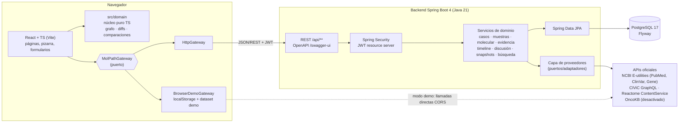

# Arquitectura de MolPath Board

> *Del microscopio al gen, y del gen a la evidencia.*
>
> Herramienta de apoyo informativo y de investigación. No sustituye el juicio clínico profesional.

## 1. Visión general



### Modos de ejecución

| Modo | Dónde | Persistencia | Uso |
|---|---|---|---|
| `api` | `docker compose up` o backend local | PostgreSQL | Modo de referencia / producción futura |
| `demo` | GitHub Pages, o `npm run dev` sin backend | `localStorage` del navegador | Demostración, uso en móvil, docencia |

El modo se fija en build con `VITE_DATA_MODE` y se muestra siempre en la barra superior. Ver ADR-002.

## 2. Principios

1. **Separación caso / conocimiento / interpretación.** Toda entidad pertenece a una de tres capas y la interfaz lo distingue visualmente:
   - *Caso* (datos del caso/paciente ficticio): caso, muestra, histología, IHQ, estudio, variante, biomarcador.
   - *Conocimiento* (bases externas con procedencia): gen, pathway, evidencia, publicación, versión de fuente.
   - *Razonamiento humano*: interpretación, comentario.
2. **Trazabilidad obligatoria.** Una evidencia no puede existir sin `source_code`; si procede de PubMed se guarda el PMID y la URL se genera (`https://pubmed.ncbi.nlm.nih.gov/{pmid}/`).
3. **Incertidumbre explícita.** Certeza con base declarada (`SOURCE_MAPPING`/`USER_ASSIGNED`/`NONE`), nunca inferida. Ver ADR-005.
4. **Nada se sobrescribe en silencio.** Auditoría, revisiones y snapshots inmutables. Ver ADR-006/007.
5. **Sin recomendaciones.** No existen endpoints ni componentes que generen diagnósticos, tratamientos u órdenes. Las asociaciones terapéuticas de fuentes externas se muestran como *asociación registrada en la fuente*.

## 3. Backend

### Paquetes (`com.molpath.board`)

| Paquete | Responsabilidad |
|---|---|
| `config` | Propiedades (`AppProperties`), OpenAPI, cliente HTTP |
| `common` | Errores (RFC 7807 `ProblemDetail`), `PageResponse`, sanitización de texto |
| `security` | JWT (emisión/validación), `CurrentUser`, login de desarrollo, CORS |
| `user` | Usuarios y roles |
| `casefile` | Casos |
| `sample` | Muestras, histología, IHQ |
| `molecular` | Estudios moleculares, variantes, biomarcadores |
| `knowledge` | Genes, pathways, fuentes y versiones, publicaciones, evidencias, enlaces variante↔evidencia |
| `provider` | Puertos y adaptadores externos (PubMed, CIViC, ClinVar, Reactome, OncoKB) |
| `board` | Agregado `CaseBoard` (lectura completa del caso para la pizarra) |
| `timeline` | Eventos temporales y línea de tiempo derivada |
| `interpretation` | Interpretaciones documentadas con sustitución versionada |
| `discussion` | Comentarios multidisciplinarios y revisiones |
| `snapshot` | Snapshots inmutables con hash |
| `search` | Clasificador de consultas y búsqueda tipada |
| `dashboard` | Resumen de actividad |
| `audit` | Registro de auditoría |
| `demo` | Siembra del dataset demo (sólo si `MOLPATH_DEMO_SEED=true` y la BD está vacía) |

Capas por módulo: `Controller` (HTTP + validación Bean Validation) → `Service` (transacciones, reglas, auditoría) → `Repository` (JPA). Las entidades JPA nunca salen del servicio: se exponen `record` DTO.

### API REST (resumen)

Documentación completa e interactiva en `/swagger-ui.html` (OpenAPI en `/v3/api-docs`).

| Recurso | Endpoints |
|---|---|
| Auth | `GET /api/auth/dev-users`, `POST /api/auth/dev-login`, `GET /api/auth/me` |
| Casos | `GET/POST /api/cases`, `GET/PUT /api/cases/{id}`, `GET /api/cases/{id}/board` |
| Muestras | `GET/POST /api/cases/{id}/samples`, `PUT /api/samples/{id}` |
| Histología / IHQ | `POST /api/samples/{id}/histology`, `PUT /api/histology/{id}`, `POST /api/samples/{id}/ihc`, `PUT/DELETE /api/ihc/{id}` |
| Molecular | `POST /api/samples/{id}/molecular-tests`, `PUT /api/molecular-tests/{id}`, `POST /api/molecular-tests/{id}/variants`, `PUT /api/variants/{id}`, `POST /api/molecular-tests/{id}/biomarkers`, `GET /api/cases/{id}/variants` |
| Evidencia | `GET/POST /api/evidence`, `GET /api/evidence/{id}`, `GET /api/evidence/{id}/history`, `PUT /api/evidence/{id}/classification`, `GET /api/cases/{id}/evidence`, `POST /api/variants/{id}/evidence-links`, `DELETE /api/variants/{id}/evidence-links/{evidenceId}` |
| Publicaciones | `GET /api/publications`, `GET /api/publications/{pmid}`, `POST /api/publications/import` |
| Pathways | `GET /api/genes/{symbol}`, `POST /api/genes/{symbol}/pathways/import` |
| Externos | `GET /api/external/providers`, `GET /api/external/evidence?source=&gene=&variant=`, `POST /api/external/evidence/import`, `GET /api/external/clinvar?gene=&variant=`, `GET /api/external/pathways?gene=` |
| Timeline | `GET /api/cases/{id}/timeline`, `POST /api/cases/{id}/timeline-events` |
| Interpretación | `GET/POST /api/cases/{id}/interpretations` |
| Discusión | `GET /api/comments?caseId=`, `POST /api/cases/{id}/comments`, `PUT /api/comments/{id}`, `GET /api/comments/{id}/revisions` |
| Snapshots | `GET/POST /api/cases/{id}/snapshots`, `GET /api/snapshots/{id}`, `GET /api/snapshots` |
| Búsqueda | `GET /api/search?q=&limit=` |
| Dashboard | `GET /api/dashboard` |

Todas las colecciones potencialmente grandes son paginadas (`page`, `size`, máximo 100) y devuelven `PageResponse { items, page, size, totalItems, totalPages }`.

### Errores

`GlobalExceptionHandler` devuelve `application/problem+json` (RFC 7807) con `type`, `title`, `status`, `detail` y, para validación, `errors[{field, message}]`. Nunca se devuelven trazas de pila.

### Seguridad

- JWT HS256 firmado con `MOLPATH_JWT_SECRET` (≥ 32 bytes). Claims: `sub` (id usuario), `role`, `name`.
- `GET` autenticado para cualquier rol; escritura clínica (casos, muestras, IHQ, molecular) para PATHOLOGY, MOLECULAR_BIOLOGY, GENETICS, BIOINFORMATICS, ADMIN; ONCOLOGY y RESEARCHER pueden comentar, interpretar, crear snapshots e importar evidencia. Matriz en `SecurityConfig`/`@PreAuthorize`.
- CORS con lista explícita de orígenes (`MOLPATH_CORS_ORIGINS`).
- Validación Bean Validation en todos los DTO de entrada; longitudes máximas alineadas con la BD.
- Texto libre: se rechazan caracteres de control y se normaliza; el frontend nunca usa `dangerouslySetInnerHTML` (React escapa por defecto) y el HTML de fuentes externas (p. ej. resaltado de Reactome) se elimina antes de almacenarlo.
- Parsers XML (PubMed efetch) con DTD y entidades externas deshabilitadas (prevención XXE).
- Cabeceras: `X-Content-Type-Options`, `Referrer-Policy`, CSP en Nginx del frontend.
- Auditoría: `audit_event` registra actor, acción, entidad y estados antes/después.

### Proveedores externos

| Puerto | Adaptador | API oficial | Estado |
|---|---|---|---|
| `PublicationProvider` | `PubMedProvider` | NCBI E-utilities `esummary`/`efetch` (db=pubmed) | Activo. Clave opcional `NCBI_API_KEY` |
| `EvidenceProvider` | `CivicProvider` | `https://civicdb.org/api/graphql` (contenido CC0) | Activo |
| `ClinicalSignificanceProvider` | `ClinVarProvider` | E-utilities `esearch`/`esummary` (db=clinvar) | Activo. Germinal, somático (clinical impact) y oncogenicidad se devuelven **por separado** |
| `PathwayProvider` | `ReactomeProvider` | ContentService: `search/query` (símbolo→UniProt) + `data/mapping/UniProt/{acc}/pathways` | Activo |
| `EvidenceProvider` | `OncoKbProvider` | — | `LICENSE_REVIEW_REQUIRED` (ADR-012) |

Cada importación registra/reutiliza una `source_version` (p. ej. "CIViC · release 01-Sep-2026", "Reactome v97") y la fecha de consulta. Las importaciones vuelven a consultar la fuente en el servidor por identificador: nunca se confía en datos científicos enviados por el cliente.

#### Mapeo de certeza CIViC (regla documentada)

| Nivel CIViC | Significado CIViC | Certeza MolPath |
|---|---|---|
| A | Validated association | STRONG |
| B | Clinical evidence | MODERATE |
| C | Case study | LIMITED |
| D | Preclinical evidence | LIMITED |
| E | Inferential association | INSUFFICIENT |

La dirección (`SUPPORTS` / `DOES_NOT_SUPPORT`) y el nivel original se conservan y muestran. `CONTRADICTORY` se detecta entre registros (ADR-005).

## 4. Frontend

```
frontend/src
├── app/            # router, layout (sidebar, topbar, breadcrumbs), providers
├── config/         # brand.ts (nombre del producto), runtime config
├── domain/         # núcleo puro: tipos, board-graph, sample-compare, snapshot-diff, contradicciones, search-classifier
├── data/           # MolPathGateway (puerto), HttpGateway, BrowserDemoGateway, clientes externos (PubMed/CIViC/ClinVar/Reactome)
├── features/       # páginas por funcionalidad (dashboard, cases, board, timeline, evidence, literature, discussion, snapshots, search, settings, learn)
├── components/     # UI reutilizable (tablas, formularios, badges de certeza, botón "Ver fuente", aviso de seguridad)
├── education/      # contenido educativo "¿Por qué importa esto?"
└── styles/         # tokens y estilos
```

- Datos remotos con TanStack Query (caché, reintentos, invalidación).
- Pizarra: `@xyflow/react` (React Flow) + `@dagrejs/dagre` para layout jerárquico izquierda→derecha, que sigue el flujo *caso → muestra → IHQ/estudio → variante → gen → pathway/evidencia → publicación*.
- Escalabilidad del grafo: los grupos (muestra, capa de conocimiento, evidencias de una variante) son colapsables; con más de `COLLAPSE_THRESHOLD` evidencias por variante se colapsan por defecto; React Flow sólo renderiza nodos visibles (`onlyRenderVisibleElements`). El listado accesible de nodos acompaña al lienzo.
- Nombre del producto centralizado en `src/config/brand.ts` y `molpath.app.name` (backend).

### Codificación visual

| Elemento | Codificación |
|---|---|
| Capa *caso* | Tarjeta sólida con barra lateral de color por tipo |
| Capa *conocimiento* | Tarjeta con borde discontinuo e icono de fuente |
| Capa *razonamiento* | Tarjeta con fondo tenue y autor/rol |
| Certeza | Badge + trazo de arista: FUERTE (continuo grueso), MODERADA (continuo), LIMITADA (discontinuo), INSUFICIENTE (punteado), CONTRADICTORIA (doble color de alerta), DESCONOCIDA (gris punteado) |

## 5. Snapshots y comparación

1. `POST /api/cases/{id}/snapshots` → el servidor construye el `CaseBoard` actual, añade `graphState` enviado por el cliente (grupos colapsados/filtros), serializa, calcula SHA-256 y guarda.
2. La vista de comparación carga el snapshot y el `CaseBoard` actual y aplica `diffSnapshot(before, after)`:
   - publicaciones nuevas/retiradas (por PMID);
   - evidencias nuevas, retiradas, con cambio de certeza/estado/nivel;
   - variantes, IHQ, muestras, biomarcadores añadidos/eliminados/modificados;
   - relaciones del grafo nuevas/eliminadas (diff de aristas);
   - versiones de fuentes cambiadas;
   - interpretaciones sustituidas ("dejaron de considerarse vigentes").

## 6. Rendimiento

- Paginación en listados (casos, evidencias, publicaciones, comentarios, snapshots, búsqueda).
- El navegador sólo recibe el agregado de un caso y las evidencias enlazadas; nunca la base de conocimiento completa.
- Índices en claves foráneas y columnas de búsqueda (`lower(symbol)`, `case_code`, `pmid`); preparado para `pg_trgm` si la búsqueda crece.
- Consultas del agregado con cargas por lotes (`IN (...)`) para evitar N+1.

## 7. Evolución prevista

- Biomarcadores TMB/MSI/HRD/firmas/expresión: tabla `biomarker_result` ya disponible con tipo extensible.
- IdP real (OIDC) sustituyendo el login de desarrollo.
- Relaciones gen→gen de cascadas desde diagramas Reactome (pendiente de fuente verificada).
- OncoKB tras revisión de licencia.
